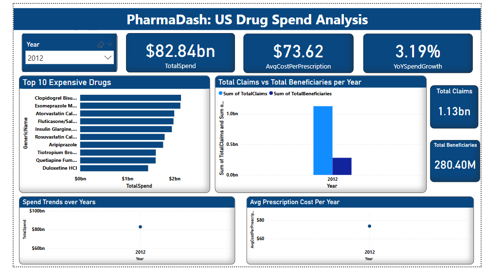

# 💊 PharmaDash: US Drug Spend Analysis

## 📋 Overview
An interactive Power BI dashboard that analyzes U.S. drug spending trends, prescription volumes, and cost drivers using CMS Medicare data.

## 🛠️ Tools Used
- **Power BI**
- DAX, Filters, Slicers, Drill-throughs

## 📈 Key Features
- Total spend: Over $1.7 Trillion across years
- Visuals: Top 10 Expensive Drugs, State-wise Spend, Claims vs Beneficiaries
- KPIs: Year-over-Year Growth, Avg. Prescription Cost, Total Spend by Condition
- Drilldowns by State, Drug Category, and Year

## 🖼️ Dashboard Preview
  

## 🗂️ Project Structure
- **dashboard/**
  - pharma_dashboard.pbix
- **screenshots/**
  - Screenshot for 2012.png
  - Screenshot for all.png
- **README.md**

## 👩‍💻 Author
**Khushi Mishra**  
[GitHub](https://github.com/KhushiMishra1707)
